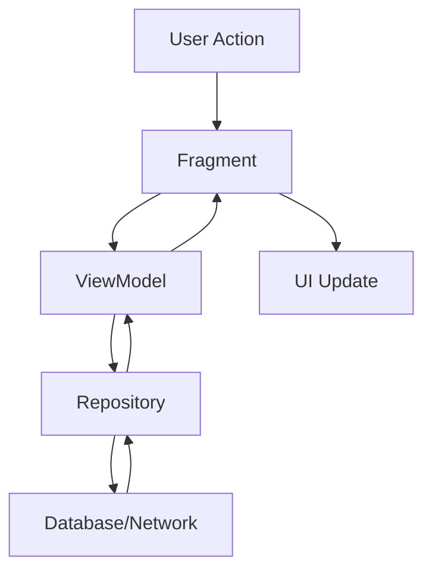
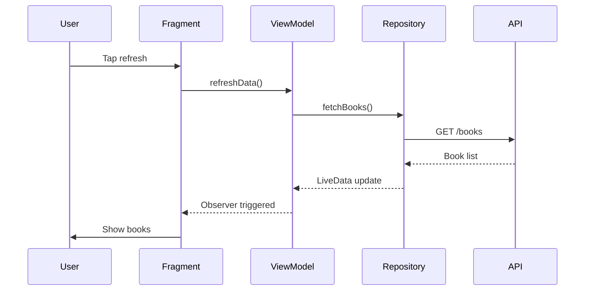
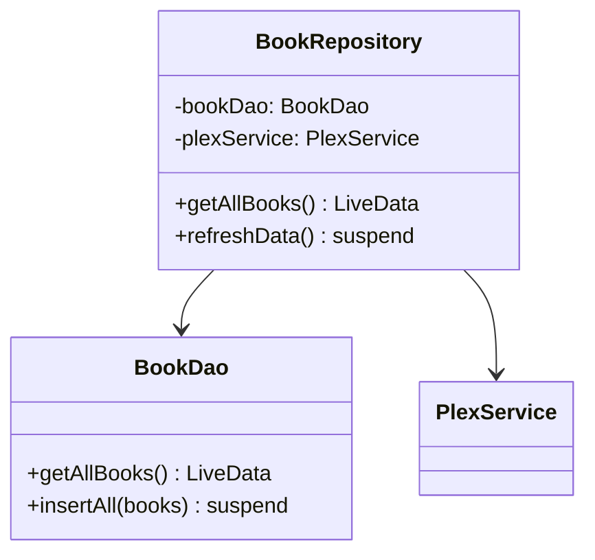
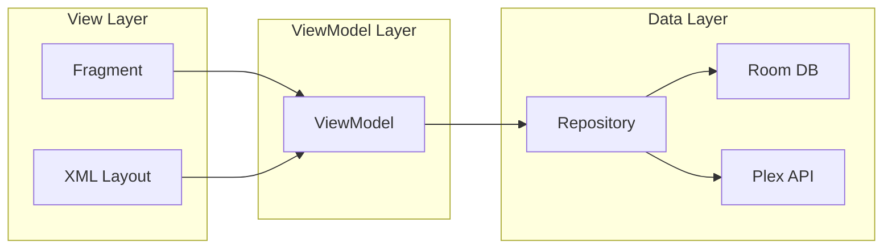

# Documentation Writing Instructions

> Authority note: repo-wide agent instructions live in [`/CLAUDE.md`](../CLAUDE.md) (single source of truth). This file only adds *style guidance for writing files under `docs/`* and must never contradict it.

Purpose: Guide coding agents to write clear, concise documentation with visual aids. Keep docs accurate and beginner-friendly.

## Core Principles
1. **Audience**: Developers new to Android/Kotlin or this codebase.
2. **Style**: Clear, simple language. Avoid jargon; if unavoidable, explain it.
3. **Structure**: Start broad, then dive into details. Use headings liberally.
4. **Examples**: Include code snippets and diagrams. Show, don't just tell.
5. **Maintenance**: Update docs when behavior or architecture changes.

## Writing Guidelines

### Language & Tone
- Use active voice: "The Repository fetches data" not "Data is fetched"
- Use second person for instructions: "You should..." not "One should..."
- Keep sentences under 25 words when possible
- One idea per paragraph
- Prefer simple words: "use" over "utilize", "start" over "commence"

### Content Structure
- **Introduction**: What this doc covers and who should read it
- **Overview**: High-level summary before diving into details
- **Sections**: Break into digestible chunks with clear headings
- **Examples**: Concrete code snippets with context
- **Summary**: Key takeaways or next steps

### Code Examples
- Keep examples short (under 30 lines)
- Use actual code from the project when possible
- Include comments explaining key points
- Show complete context, not isolated fragments
- Use `// ...existing code...` for unchanged sections

```kotlin
// Good example - clear and contextual
class BookRepository @Inject constructor(
    private val bookDao: BookDao,
    private val plexService: PlexService
) {
    // Return LiveData for automatic UI updates
    fun getAllBooks(): LiveData<List<Audiobook>> {
        return bookDao.getAllBooks()
    }
    
    // Suspend function for one-time fetch
    suspend fun refreshData() = withContext(Dispatchers.IO) {
        val books = plexService.getAlbums()
        bookDao.insertAll(books)
    }
}
```

### Visual Aids - Use Mermaid

Prefer Mermaid diagrams over ASCII art for complex flows. Mermaid renders in GitHub and most IDEs.

**Flow Diagrams** (for processes, data flow):


**Sequence Diagrams** (for interactions over time):


**Class Diagrams** (for structure):


**Architecture Diagrams**:


### When to Use Mermaid vs. Text
- **Use Mermaid**: Complex flows, multi-step processes, class relationships, system architecture
- **Use text/lists**: Simple lists, short sequences, single concepts, quick reference

### Formatting Standards

#### Headings
```markdown
# Document Title (H1) - once per document
## Major Section (H2)
### Subsection (H3)
#### Detail (H4) - use sparingly
```

#### Emphasis
- **Bold** for important terms, UI elements, emphasis
- *Italic* for light emphasis, citations
- `Code font` for class names, functions, variables, file paths
- > Blockquotes for notes, warnings, tips

#### Lists
```markdown
- Unordered for options, features, non-sequential items
  - Nested items
  
1. Ordered for steps, procedures, sequences
2. Second step
```

#### Links
- Use relative paths for internal docs: `[Architecture](./02-architecture.md)`
- Use descriptive link text: `[Android Architecture Guide](https://...)` not `[click here](...)`
- Verify links work before committing

## Document-Specific Guidelines

### When Updating Existing Docs

**README.md** - Update when:
- Adding/removing documents
- Changing documentation structure
- Adding new key technologies

**02-architecture.md** - Update when:
- Changing architectural patterns (MVVM, Repository, etc.)
- Adding new major libraries
- Modifying DI structure
- Changing threading/coroutine patterns

**04-key-components.md** - Update when:
- Adding major new classes (Services, Repositories, ViewModels)
- Changing component responsibilities
- Modifying how components interact

**05-data-flow.md** - Update when:
- Changing how data moves through layers
- Modifying LiveData/coroutine patterns
- Adding new data sources
- Changing offline mode behavior

**06-adding-features.md** - Update when:
- Establishing new development patterns
- Adding new types of features (new DB table, new API, etc.)
- Changing best practices

### Creating New Documentation

Template structure:
```markdown
# [Title]

Brief intro: what this covers and who needs it.

## Overview
High-level summary (2-3 paragraphs).

## [Main Topic 1]
Detailed explanation with examples.

## [Main Topic 2]
More details.

## Practical Example
Real-world walkthrough.

## Best Practices
- Practice 1
- Practice 2

## Common Pitfalls
- Issue and solution
- Another issue and solution

## References
- [Related doc](./other.md)
- [External resource](https://)
```

## Quality Checklist

Before committing documentation:
- [ ] Content accurate and up-to-date with current code
- [ ] Language clear and beginner-friendly
- [ ] Technical terms explained or linked to glossary
- [ ] Code examples tested and working
- [ ] Mermaid diagrams render correctly
- [ ] All links functional
- [ ] Formatting consistent
- [ ] Cross-references correct
- [ ] No typos/grammar errors
- [ ] Updated index (README.md) if needed

## Common Patterns

### Explaining Architecture
```markdown
## Component Name

**What it does**: One-line purpose.

**Why it exists**: Architectural reason.

**How to use it**:
```kotlin
// Code example
```

**Key methods**:
- `method1()` - What it does
- `method2()` - What it does
```

### Documenting Data Flow
Use Mermaid sequence diagrams showing:
1. User action
2. Component interactions
3. Data transformations
4. UI updates

Include code snippets for each major step.

### Explaining Patterns
1. State the pattern name
2. Explain the problem it solves
3. Show code example
4. Explain benefits
5. Note when to use/avoid

## Don'ts
❌ Don't assume Android/Kotlin knowledge
❌ Don't use jargon without explanation
❌ Don't show code without context
❌ Don't let docs drift from code
❌ Don't create walls of text
❌ Don't skip visual aids for complex topics
❌ Don't forget to update index

## Quick Commands

To preview Mermaid locally:
- Use IDE plugins (IntelliJ has built-in Mermaid support)
- Use [Mermaid Live Editor](https://mermaid.live)
- View on GitHub (automatic rendering)

## References
- [Mermaid Documentation](https://mermaid.js.org/)
- [Markdown Guide](https://www.markdownguide.org/)
- [Chronicle Documentation Index](./README.md)

