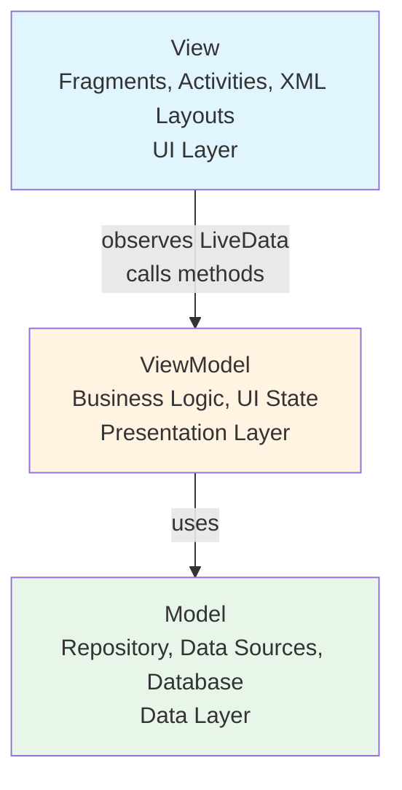
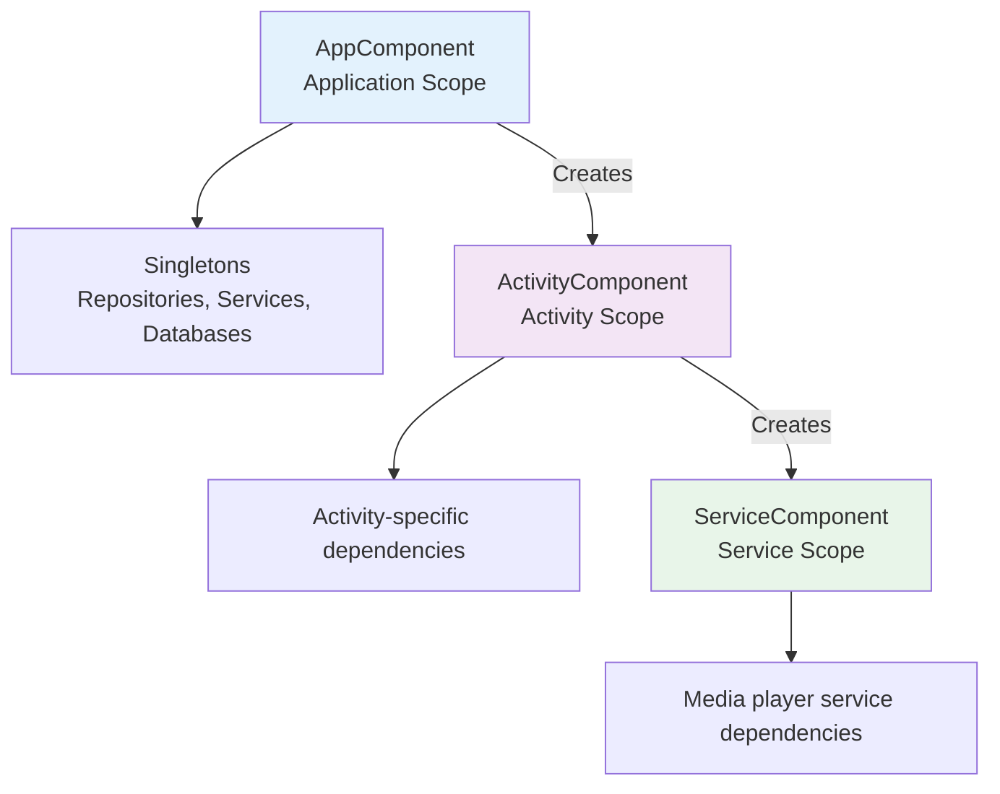
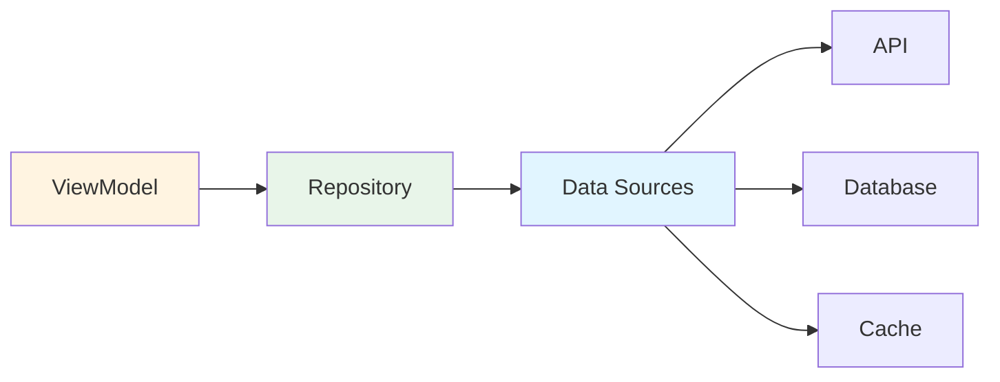
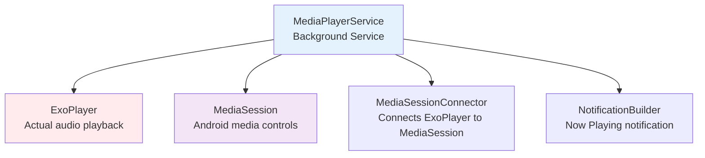
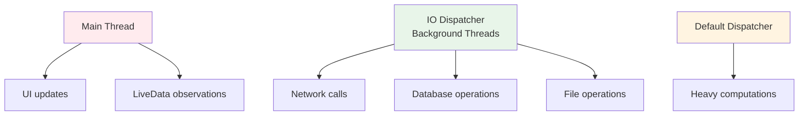

# Architecture

## Overview

Chronicle follows a layered architecture with clear separation of concerns. It uses several modern Android architecture patterns and libraries.

## Architecture Pattern: MVVM

The app uses **Model-View-ViewModel (MVVM)** architecture:

### View (UI Layer)
- **Fragments**: Each screen is a Fragment (HomeFragment, LibraryFragment, etc.)
- **Activities**: Single MainActivity hosts all fragments
- **Data Binding**: XML layouts bind directly to ViewModel properties
- **Responsibilities**: Display data, handle user input, navigation

### ViewModel (Presentation Layer)
- **Purpose**: Holds UI state and handles UI logic
- **Lifecycle**: Survives configuration changes (screen rotation)
- **Communication**: Exposes `LiveData` to Views, calls Repository methods
- **Examples**: `HomeViewModel`, `LibraryViewModel`, `CurrentlyPlayingViewModel`

### Model (Data Layer)
- **Repositories**: Single source of truth for data (`BookRepository`, `TrackRepository`)
- **Data Sources**: Where data comes from (Plex API, Local Database, File System)
- **Database**: Room database for local caching
- **Responsibilities**: Fetch, cache, and manage data

## Key Architectural Components

### 1. Dependency Injection (Dagger 2)

Dagger 2 handles all object creation and dependency management:

**Why Dagger?**
- Compile-time dependency verification
- No reflection overhead
- Clear dependency graph
- Easy testing with mock implementations

### 2. Repository Pattern

Repositories abstract data sources from the rest of the app:

**Example**: `BookRepository`
- Fetches books from Plex API
- Caches in Room database
- Returns LiveData to ViewModels
- Handles offline mode

### 3. Reactive Programming (LiveData + Coroutines)

**LiveData**: Observable data holder
- Lifecycle-aware (automatically stops updates when UI is inactive)
- Used for UI updates

**Coroutines**: For asynchronous operations
- Network calls
- Database operations
- File I/O
- Background processing

### 4. Media Architecture (ExoPlayer + MediaSession)

**MediaServiceConnection**: Activities/Fragments bind to the service
- Sends playback commands
- Receives playback state updates
- Survives across the entire app lifecycle

## Data Sources

### 1. Plex API (Remote)
- **PlexService**: Retrofit interface for API calls
- **PlexMediaRepository**: Manages Plex data
- **PlexLoginRepo**: Handles authentication

### 2. Room Database (Local)
- **BookDatabase**: Stores audiobook metadata
- **TrackDatabase**: Stores track/chapter information
- **CollectionsDatabase**: Stores collection data

### 3. File System (Local Cache)
- **CachedFileManager**: Manages downloaded audio files
- **Fetch**: Library for downloading files

## Navigation

**Navigator**: Single class managing all screen transitions
- Fragment transactions
- Back stack management
- Login flow routing
- Deep linking support

## Threading Model

## State Management

- **ViewModel State**: `LiveData` properties exposed by ViewModels
- **SharedPreferences**: User settings and preferences (`PrefsRepo`)
- **Database**: Persisted data state
- **PlexConfig**: Plex-specific configuration and state

## Benefits of This Architecture

1. **Separation of Concerns**: Each layer has clear responsibilities
2. **Testability**: Easy to mock dependencies and test in isolation
3. **Maintainability**: Changes in one layer don't break others
4. **Lifecycle Management**: ViewModels and LiveData handle Android lifecycle automatically
5. **Offline Support**: Repository pattern makes it easy to switch between online/offline data
6. **Scalability**: New features follow established patterns

## Common Patterns Used

- **Factory Pattern**: For creating ViewModels with dependencies
- **Observer Pattern**: LiveData observers in Views
- **Repository Pattern**: Single source of truth for data
- **Singleton Pattern**: Application-scoped objects (via Dagger)
- **Service Pattern**: Background media playback

