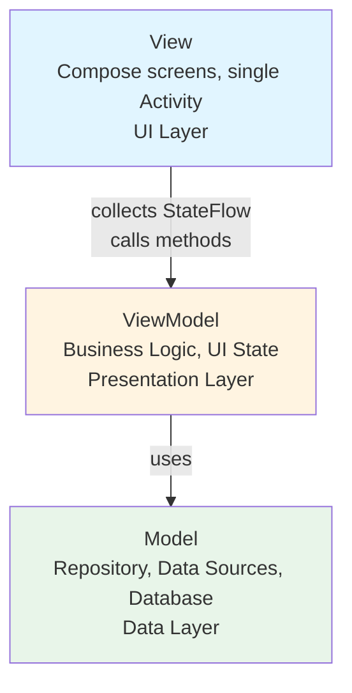
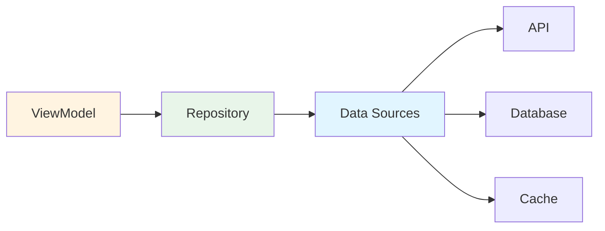
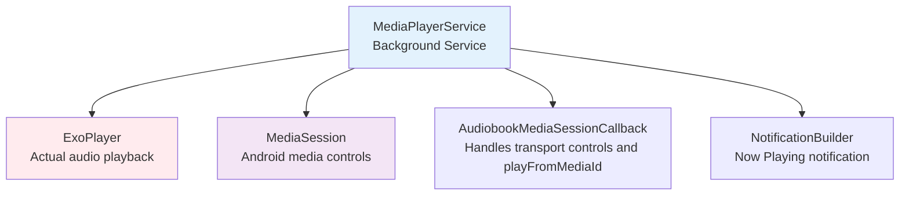
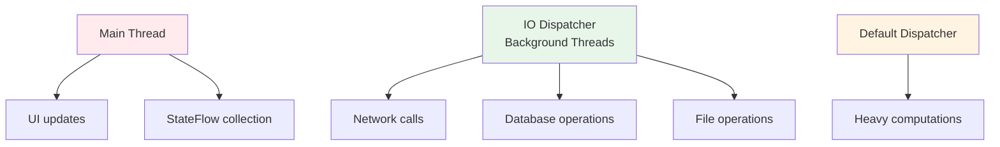

# Architecture

## Overview

Chronicle follows a layered architecture with clear separation of concerns. It uses several modern Android architecture patterns and libraries.

## Architecture Pattern: MVVM

The app uses **Model-View-ViewModel (MVVM)** architecture:

### View (UI Layer)
- **Compose screens**: every screen is a composable function of state — `features/<x>/compose/<X>Screen.kt` — paired with a `<X>Destination.kt` that wires a `hiltViewModel()` into it and passes callbacks. The Fragment-per-screen structure ([[decision-22]]) is gone entirely as of cu-206; there is no ViewBinding and no XML layout left
- **Activities**: single `MainActivity` calls `setContent {}` once and hosts a Navigation Compose `NavHost` — see the Navigation section below
- **One deliberate exception**: `features/player/compose/CastButton.kt` wraps the Cast SDK's `MediaRouteButton` in an `AndroidView`, because the SDK has no Compose surface (decision-19)
- **Responsibilities**: Display data, handle user input, navigation

### ViewModel (Presentation Layer)
- **Purpose**: Holds UI state and handles UI logic
- **Lifecycle**: Survives configuration changes (screen rotation)
- **Communication**: Exposes `StateFlow` to Views, calls Repository methods
- **Examples**: `HomeViewModel`, `LibraryViewModel`, `CurrentlyPlayingViewModel`

### Model (Data Layer)
- **Repositories**: Single source of truth for data (`BookRepository`, `TrackRepository`)
- **Data Sources**: Where data comes from (Plex API, Local Database, File System)
- **Database**: Room database for local caching
- **Responsibilities**: Fetch, cache, and manage data

## Key Architectural Components

### 1. Dependency Injection (Dagger 2 via Hilt)

Dagger 2 still handles all object creation, but since cu-185 it is Hilt's generated components,
not hand-rolled ones: `@HiltAndroidApp` on `ChronicleApplication`, `@AndroidEntryPoint` on
`MainActivity` and `MediaPlayerService`, `hiltViewModel()` in every `<X>Destination.kt`.
`injection/modules/*.kt` are `@Module @InstallIn(SingletonComponent::class | ActivityComponent::class
| ServiceComponent::class)` — those three component types are Hilt's own
(`dagger.hilt.android.components.*`), not classes this codebase declares:

### 2. Repository Pattern

Repositories abstract data sources from the rest of the app:

**Example**: `BookRepository`
- Fetches books from Plex API
- Caches in Room database
- Returns `Flow`/`StateFlow` to ViewModels
- Handles offline mode

### 3. Reactive Programming (StateFlow + Coroutines)

**StateFlow**: Observable state holder (cu-52 — there is **no `LiveData` left in this codebase**)
- Always has a current value, replayed to every new collector
- **Not** lifecycle-aware by itself: collect via `collectWhileStarted` /
  `collectEventsWhileStarted` (`util/FlowCollect.kt`), which wrap `repeatOnLifecycle(STARTED)`.
  Never a bare `lifecycleScope.launch`, never the deprecated `launchWhenStarted`
- **Conflates equal consecutive values**, where a `LiveData.map` used to re-emit. A one-shot signal
  therefore needs `Event<T>`, not a plain value
- `stateIn(viewModelScope, WhileSubscribed(STOP_TIMEOUT_MILLIS), initial)` is the default;
  **`Eagerly`** is required when a click handler reads `.value` without anything collecting it,
  or the read returns the seed
- `postValue` is banned outright and `PostValueUsageTest` fails the build on it

**Coroutines**: For asynchronous operations
- Network calls
- Database operations
- File I/O
- Background processing

### 4. Media Architecture (ExoPlayer + MediaSession)

**MediaServiceConnection**: `MainActivity` (and, through it, screens/ViewModels) binds to the service
- Sends playback commands
- Receives playback state updates
- Survives across the entire app lifecycle

## Data Sources

### 1. Plex API (Remote)
- **PlexService**: Retrofit interface for API calls
- **PlexMediaRepository**: Manages Plex data
- **PlexLoginRepo**: Handles authentication

### 2. Room Database (Local) — **five separate databases**

Each has its own version and migration list, so a schema change means finding the right one. None
use `fallbackToDestructiveMigration`, deliberately: a bad migration must crash, never silently wipe
listening progress.

- **BookDatabase** (v14): audiobook metadata
- **TrackDatabase** (v7): tracks. `viewOffset` here is the source of truth for position
  ([[decision-16]])
- **ChapterDatabase** (v3): chapters — and **nowhere else** since cu-159 dropped
  `Audiobook.chapters`
- **CollectionsDatabase** (v3): Plex collections
- **BookmarkDatabase** (v1): bookmarks, kept **outside `BookDatabase` on purpose** so the sync path
  cannot delete a note the user wrote (cu-22)

### 3. File System (Local Cache)
- **CachedFileManager**: Manages downloaded audio files
- **Fetch2**: download library, **vendored** at `libs/fetch2-mirror` (cu-166 — upstream is
  abandoned and was arriving via JitPack)

## Navigation

Navigation Compose replaced `Navigator` in cu-206 (`Navigator.kt` is deleted). Three pieces:

- **`navigation/Destination.kt`**: a framework-free sealed interface — one `data object`/`data
  class` per screen, each holding its own route string. `encodeArg`/`decodeArg` percent-encode
  route arguments that can contain arbitrary text (a book title, a facet value), since
  Navigation Compose addresses destinations by string route and a raw `/` or `?` in an argument
  would silently fail to match the pattern. `destinationForLogin(state)` is the pure routing
  decision `Navigator`'s init block used to make from `IPlexLoginRepo.loginEvent`.
- **`navigation/compose/ChronicleNavHost.kt`**: the `NavHost` graph — one `composable(...)` entry
  per `Destination`, wiring each to its `<X>Destination.kt`.
- **`application/compose/ChronicleApp.kt`**: the app shell — the Compose `NavigationBar` (bottom
  tabs), the nav host, and the currently-playing sheet stacked on top of both.

`MainActivity` builds the `NavHostController` (`rememberNavController()`), collects
`plexLoginRepo.loginEvent` itself and navigates on it — the one thing that has to live above any
single screen — and registers the back handler via `OnBackPressedDispatcher` (not an
`onBackPressed()` override, which the platform's mandatory predictive-back gesture at targetSdk 36
never calls, cu-73). Backstack clearing (`Navigator`'s
`while (backStackEntryCount > 0) popBackStackImmediate()`) is `popUpTo(startDestination)`; the tab
tags that drove "is this fragment already showing" checks are gone with the tags themselves —
Navigation Compose exposes `currentBackStackEntry` instead.

## Threading Model

## State Management

- **ViewModel State**: `StateFlow` properties exposed by ViewModels
- **SharedPreferences**: User settings and preferences (`PrefsRepo`)
- **Database**: Persisted data state
- **PlexConfig**: Plex-specific configuration and state

## What the layering buys

The one non-obvious point: **lifecycle management**. ViewModels scope work to `viewModelScope`, and
Views collect through `collectWhileStarted` — that extension is what makes collection
lifecycle-aware, and a bare `lifecycleScope.launch` keeps collecting while backgrounded.

## Common Patterns Used

- **Factory Pattern**: For creating ViewModels with dependencies
- **Observer Pattern**: `StateFlow` collectors in Views
- **Repository Pattern**: Single source of truth for data
- **Singleton Pattern**: Application-scoped objects (via Dagger)
- **Service Pattern**: Background media playback

