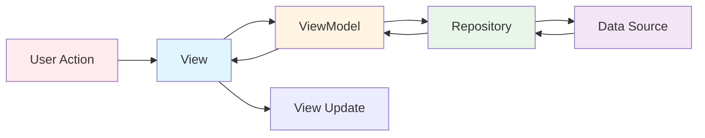
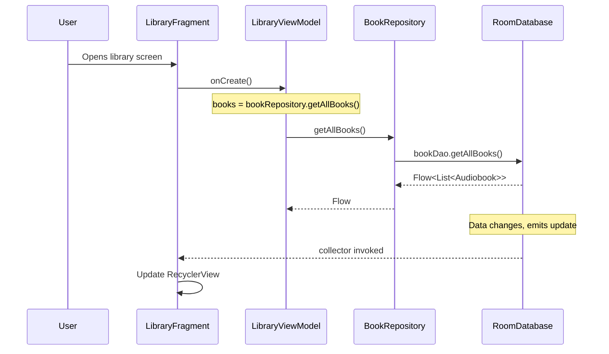
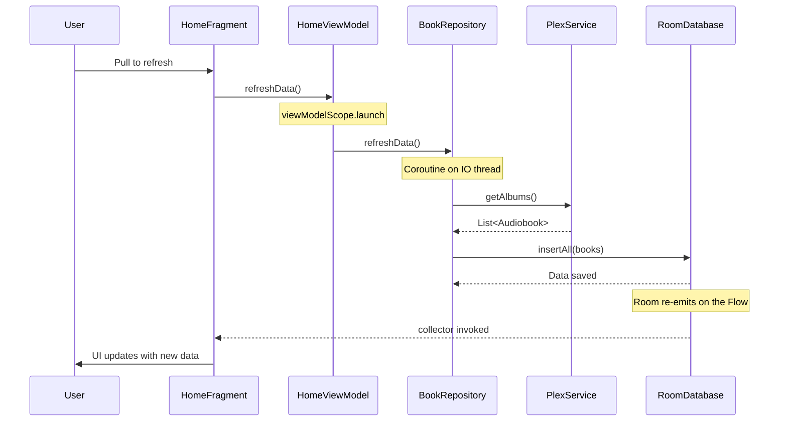
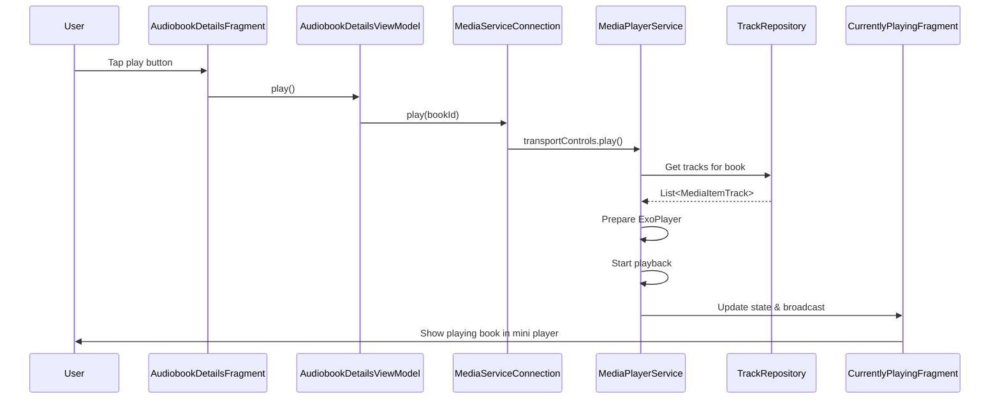
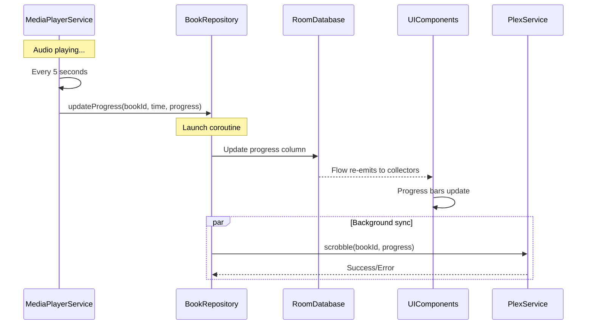
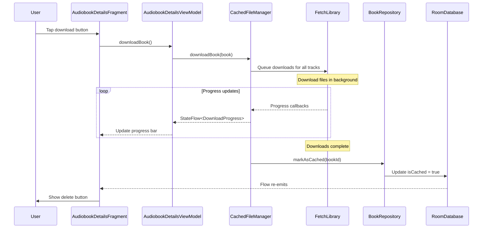

# Data Flow

Understanding how data moves through Chronicle will help you implement features correctly.

## Overview

Chronicle uses a **unidirectional data flow** pattern:



This keeps data flow predictable and makes debugging easier.

## Key Concepts

### StateFlow
- **Observable** state holder, always carrying a current value
- **Replays to every new collector** — unlike `LiveData`, a late collector still sees the value
- **Conflates equal consecutive values**: a repeated identical emission is dropped, so anything
  that must fire each time needs `Event<T>`
- **Not lifecycle-aware by itself**: ViewModels expose `StateFlow`, Views collect it through
  `collectWhileStarted` (`util/FlowCollect.kt`), which wraps `repeatOnLifecycle(STARTED)`
- There is **no `LiveData` in this codebase**; `postValue` is banned by a build gate

### Coroutines
- Handle **asynchronous** operations (network, database, file I/O)
- Use **Dispatchers**:
  - `Dispatchers.Main` - UI thread
  - `Dispatchers.IO` - Background I/O operations
  - `Dispatchers.Default` - CPU-intensive work

## Common Data Flow Patterns

### 1. Displaying a List of Books



**Code example**:
```kotlin
// In LibraryFragment
collectWhileStarted(viewModel.books) { books ->
    adapter.submitList(books)  // Update UI
}

// In LibraryViewModel
val books: StateFlow<List<Audiobook>> =
    bookRepository.getAllBooks()
        .stateIn(viewModelScope, SharingStarted.WhileSubscribed(STOP_TIMEOUT_MILLIS), emptyList())

// In BookRepository
fun getAllBooks(): Flow<List<Audiobook>> {
    return bookDao.getAllBooks()  // Room automatically updates this
}
```

### 2. Refreshing Data from Server



**Code example**:
```kotlin
// In HomeFragment
binding.swipeToRefresh.setOnRefreshListener {
    viewModel.refreshData()
}

collectWhileStarted(viewModel.isRefreshing) { isRefreshing ->
    binding.swipeToRefresh.isRefreshing = isRefreshing
}

// In HomeViewModel
fun refreshData() {
    viewModelScope.launch {
        _isRefreshing.value = true
        bookRepository.refreshData()  // Suspending function
        _isRefreshing.value = false
    }
}

// In BookRepository
suspend fun refreshData() = withContext(Dispatchers.IO) {
    val books = plexService.getAlbums()  // Network call
    bookDao.insertAll(books)  // Save to DB
}
```

### 3. Playing an Audiobook



### 4. Saving Playback Progress



**Code example**:
```kotlin
// In MediaPlayerService
private fun updateProgress() {
    val position = player.currentPosition
    val bookId = currentlyPlaying.audiobook.id
    
    serviceScope.launch {
        bookRepository.updateProgress(
            bookId = bookId,
            currentTime = System.currentTimeMillis(),
            progress = position
        )
    }
}

// In BookRepository
suspend fun updateProgress(bookId: String, currentTime: Long, progress: Long) {
    withContext(Dispatchers.IO) {
        // Update local database
        bookDao.updateProgress(bookId, currentTime, progress)
        
        // Sync to Plex (fire and forget)
        launch {
            try {
                plexService.scrobble(bookId, progress)
            } catch (e: Exception) {
                Timber.e(e, "Failed to scrobble")
            }
        }
    }
}
```

### 5. Downloading an Audiobook



## State Management

### ViewModel State

ViewModels hold UI state using:
- **StateFlow**: For observable state (lists, loading states)
- **MutableStateFlow**: Internal mutable version
- **Private setters**: Only ViewModel can change state

```kotlin
class HomeViewModel : ViewModel() {
    // Private mutable version
    private val _isRefreshing = MutableStateFlow(false)
    
    // Public immutable version exposed to UI
    val isRefreshing: StateFlow<Boolean>
        get() = _isRefreshing
    
    fun refreshData() {
        _isRefreshing.value = true
        // ... do work ...
        _isRefreshing.value = false
    }
}
```

### Repository State

Repositories manage data state:
- **Database**: Persistent state (cached data)
- **Memory Cache**: Temporary state (in-memory variables)
- **Network**: Remote state (Plex server)

```kotlin
class BookRepository {
    // Database = source of truth
    fun getAllBooks(): Flow<List<Audiobook>> {
        return bookDao.getAllBooks()
    }
    
    // Network updates database
    suspend fun refreshData() {
        val books = plexService.getAlbums()
        bookDao.insertAll(books)  // Database auto-notifies observers
    }
}
```

## Threading Rules

1. **UI Operations**: Must be on Main thread
   - Updating Views
   - StateFlow collection
   - ViewModel property access

2. **Database Operations**: Use IO thread
   - Room queries (except `Flow` queries, which Room runs off the main thread)
   - File operations

3. **Network Operations**: Use IO thread
   - Retrofit calls
   - HTTP requests

4. **Heavy Computation**: Use Default thread
   - Processing large data
   - Complex calculations

**Example**:
```kotlin
viewModelScope.launch {  // Runs on Main by default
    _isLoading.value = true
    
    val result = withContext(Dispatchers.IO) {  // Switch to IO thread
        repository.fetchData()  // Network/DB operation
    }
    
    // Back on Main thread
    _data.value = result
    _isLoading.value = false
}
```

## Error Handling

Errors flow back through the same path:

```
Data Source → Repository (catch, log, transform) → ViewModel (handle, show to user) → View (display error)
```

**Example**:
```kotlin
// In Repository
suspend fun refreshData(): Result<Unit> {
    return try {
        val books = plexService.getAlbums()
        bookDao.insertAll(books)
        Result.success(Unit)
    } catch (e: Exception) {
        Timber.e(e, "Failed to refresh")
        Result.failure(e)
    }
}

// In ViewModel
fun refreshData() {
    viewModelScope.launch {
        repository.refreshData().fold(
            onSuccess = { _message.value = Event("Refreshed successfully") },
            onFailure = { _message.value = Event("Failed to refresh: ${it.message}") },
        )
    }
}
```

## Offline Mode

Chronicle handles offline mode through the Repository pattern:

```kotlin
// Repository decides source based on offline mode
fun getAllBooks(): Flow<List<Audiobook>> {
    return if (prefsRepo.offlineMode) {
        bookDao.getCachedBooks()  // Only cached books
    } else {
        bookDao.getAllBooks()  // All books
    }
}
```

## Data flow rules

1. **One direction.** Data flows down (repository → ViewModel → View), events flow up.
2. **`StateFlow` for state, `Event<T>` for one-shots.** `StateFlow` conflates — a repeated
   identical value is dropped, and a re-subscription replays the last one.
3. **Never touch the database from the UI.** Repositories own it.
4. **Never hardcode a dispatcher.** Inject `DispatcherProvider`; a build gate enforces it.
5. **Combine with `combineDistinct`**, not a bare `combine`.
6. **Offline mode is a read that must be honoured on every path**, not a special case.
