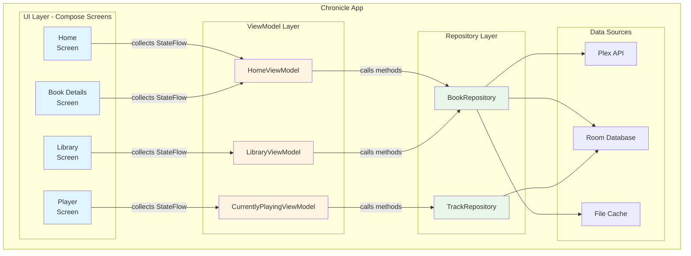
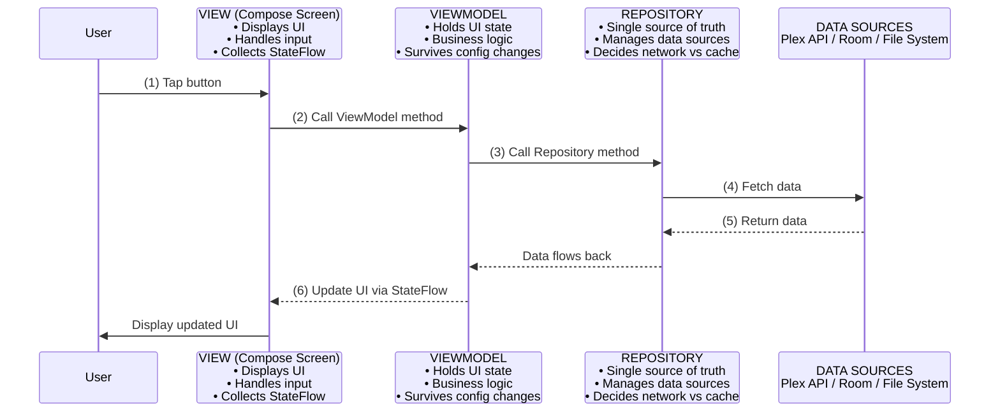
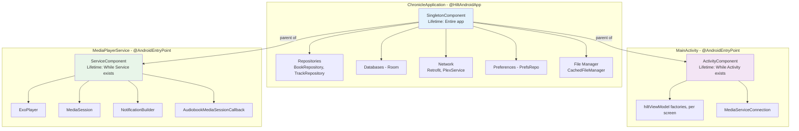
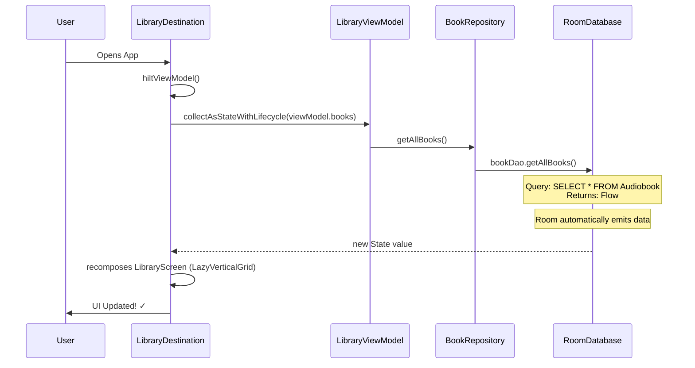
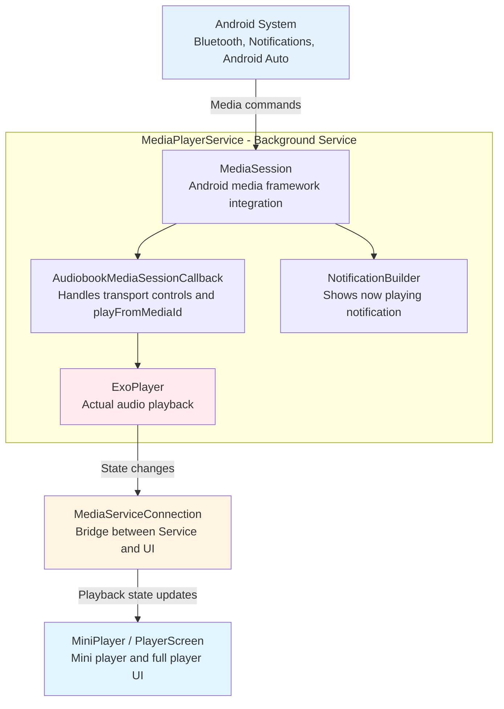
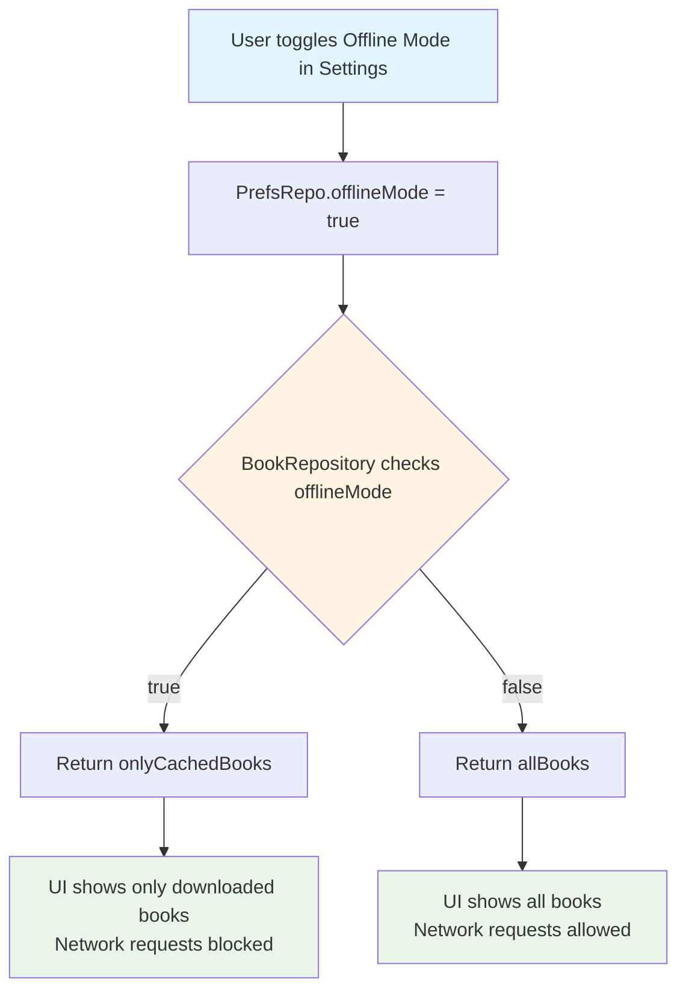
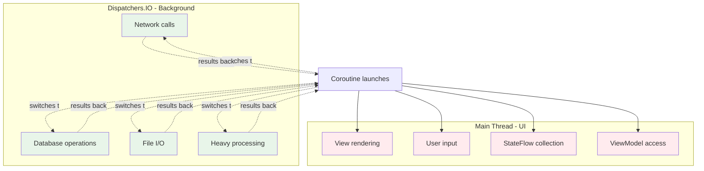
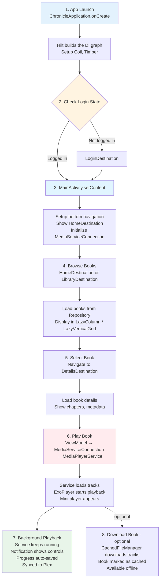

# Visual Architecture Guide

This document provides visual representations of Chronicle's architecture for quick reference.

## App Structure Overview



## MVVM Flow



## Dependency Injection Hierarchy

These three components are Hilt's own generated types, not hand-written classes —
`ActivityModule.kt`/`ServiceModule.kt`/`AppModule.kt` attach providers to them with
`@InstallIn(...)`:



## Feature Module Structure

Each feature in `features/` follows this pattern:

```
features/home/
│
├── HomeViewModel.kt
│   ├─ Holds UI state (StateFlow properties)
│   ├─ Calls Repository methods
│   ├─ Transforms data for UI
│   └─ @HiltViewModel — injected via Hilt, obtained with hiltViewModel()
│
└── compose/
    ├── HomeScreen.kt
    │   ├─ Pure function of state — no ViewModel reference
    │   ├─ Renders the shelves (LazyColumn / LazyVerticalGrid, never a RecyclerView adapter)
    │   └─ Emits callbacks for user interactions (onBookClick, etc.)
    │
    └── HomeCircuit.kt
        ├─ Calls hiltViewModel() to get the ViewModel
        ├─ Collects its StateFlow via collectAsStateWithLifecycle()
        └─ Passes state + callbacks into HomeScreen
```

## Data Flow Example: Loading Books



## Media Playback Architecture



## Offline Mode Logic



## Threading Model



## Typical User Flow



## Quick Reference: Where to Find Things

| I want to...                | Look in...                              |
|-----------------------------|-----------------------------------------|
| Add a new screen            | `features/newfeature/`                  |
| Modify book data            | `data/local/BookRepository.kt`          |
| Change Plex API calls       | `data/sources/plex/PlexService.kt`      |
| Modify playback logic       | `features/player/MediaPlayerService.kt` |
| Add a setting               | `features/settings/SettingsViewModel.kt` (`settingsRows`) + `SharedPreferencesPrefsRepo.kt` |
| Change UI layout            | `features/*/compose/`                   |
| Add dependency injection    | `injection/` (Hilt modules)              |
| Modify navigation           | `navigation/Screens.kt` (screen keys) + `navigation/circuit/ChronicleCircuit.kt` (graph) |
| Change app initialization   | `application/ChronicleApplication.kt`   |
| Add database table/field    | one of **five** DBs in `data/local/` — chapters live in `ChapterDatabase`, bookmarks in `BookmarkDatabase` |

