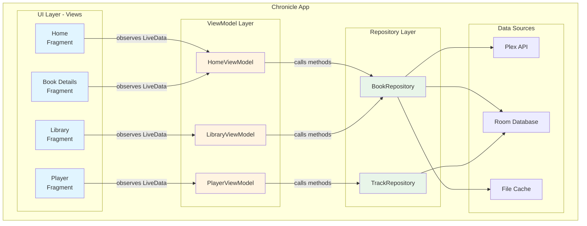
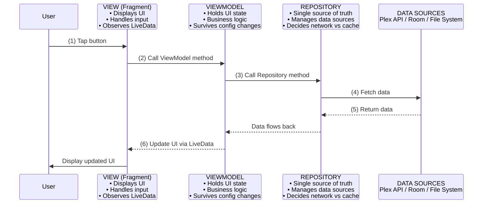
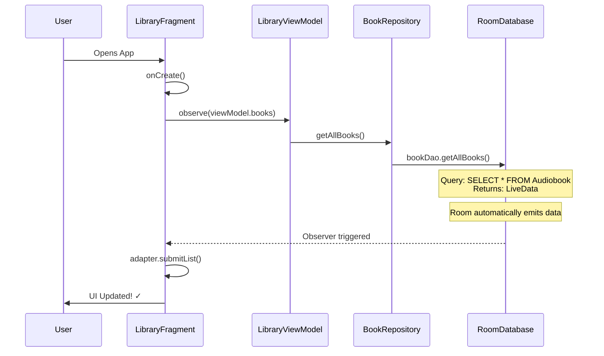
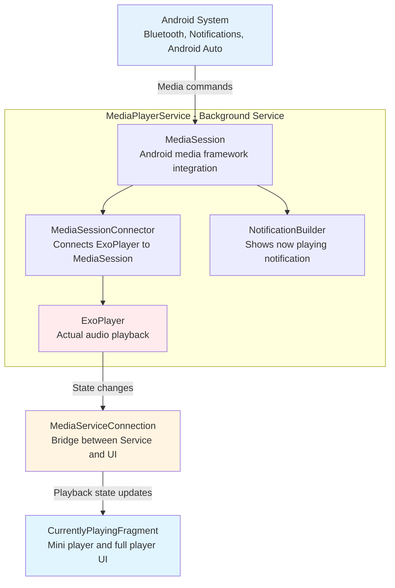
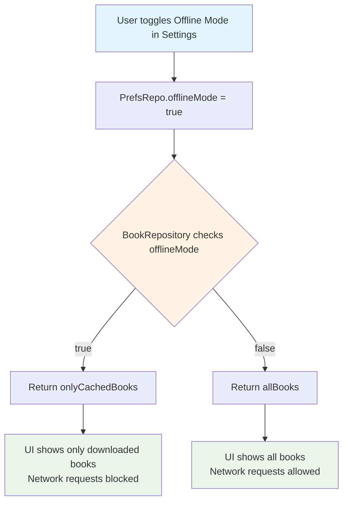
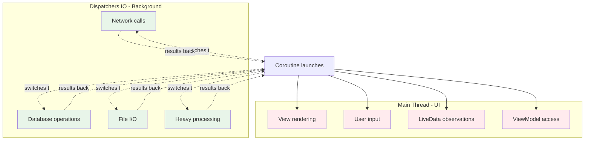
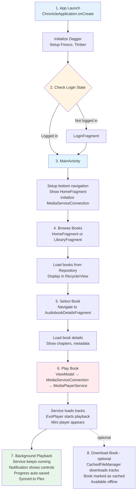

# Visual Architecture Guide

This document provides visual representations of Chronicle's architecture for quick reference.

## App Structure Overview



## MVVM Flow



## Dependency Injection Hierarchy

```mermaid
graph TB
    subgraph ChronicleApplication - @Singleton
        A[AppComponent<br/>Lifetime: Entire app]
        A1[Repositories<br/>BookRepository, TrackRepository]
        A2[Databases - Room]
        A3[Network<br/>Retrofit, PlexService]
        A4[Preferences - PrefsRepo]
        A5[File Manager<br/>CachedFileManager]
        A --> A1
        A --> A2
        A --> A3
        A --> A4
        A --> A5
    end
    
    subgraph MainActivity - @ActivityScope
        B[ActivityComponent<br/>Lifetime: While Activity exists]
        B1[ViewModelFactories]
        B2[Navigator]
        B3[MediaServiceConnection]
        B --> B1
        B --> B2
        B --> B3
    end
    
    subgraph MediaPlayerService - @ServiceScope
        C[ServiceComponent<br/>Lifetime: While Service exists]
        C1[ExoPlayer]
        C2[MediaSession]
        C3[NotificationBuilder]
        C4[MediaSessionConnector]
        C --> C1
        C --> C2
        C --> C3
        C --> C4
    end
    
    A -->|creates| B
    A -->|creates| C
    
    style A fill:#e3f2fd
    style B fill:#f3e5f5
    style C fill:#e8f5e9
```

## Feature Module Structure

Each feature in `features/` follows this pattern:

```
features/home/
│
├── HomeFragment.kt
│   ├─ Inflates layout
│   ├─ Observes ViewModel LiveData
│   ├─ Handles user interactions
│   └─ Updates UI when data changes
│
├── HomeViewModel.kt
│   ├─ Holds UI state (LiveData properties)
│   ├─ Calls Repository methods
│   ├─ Transforms data for UI
│   └─ Factory for Dagger injection
│
└── (Adapters, custom views if needed)
    └─ AudiobookAdapter.kt
       └─ RecyclerView adapter for book lists
```

## Data Flow Example: Loading Books



## Media Playback Architecture



## Offline Mode Logic



## Threading Model



## Typical User Flow



## Quick Reference: Where to Find Things

| I want to...                | Look in...                              |
|-----------------------------|-----------------------------------------|
| Add a new screen            | `features/newfeature/`                  |
| Modify book data            | `data/local/BookRepository.kt`          |
| Change Plex API calls       | `data/sources/plex/PlexService.kt`      |
| Modify playback logic       | `features/player/MediaPlayerService.kt` |
| Add a setting               | `data/local/PrefsRepo.kt`               |
| Change UI layout            | `res/layout/`                           |
| Add dependency injection    | `injection/`                            |
| Modify navigation           | `navigation/Navigator.kt`               |
| Change app initialization   | `application/ChronicleApplication.kt`   |
| Add database table/field    | `data/local/BookDatabase.kt`            |

